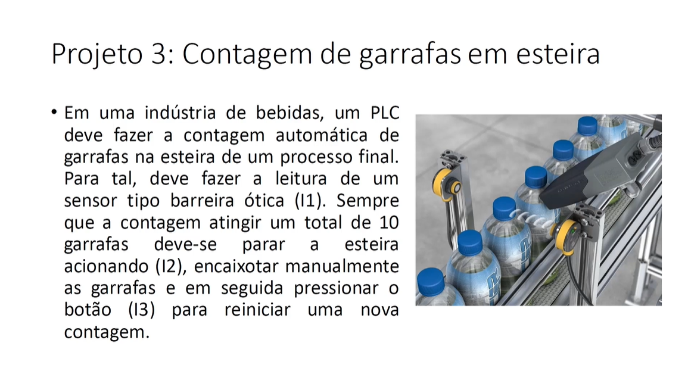
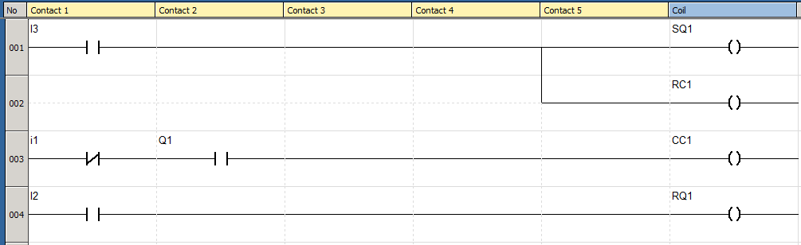

# 
  Bottle-Counting 

## Goal

This is a Bottle Counter project that I have created using ladder language as one of the projects required in the course [Treinamento em Lógica Ladder para CLP/PLC](https://www.udemy.com/course/treinamento-em-logica-ladder-para-plc/)

## Requirements 

The requirements to this project are described in the image bellow. 

## Implementation 

The program was created using ZelioSoft2 software, which is one of the software created by Schneider Electrics for Ladder programming on their Zelio series PLCs.

The ladder program is show bellow

In this program Q1 is the motor, CC1 is the counter and I1 is the optical barrier, I2 is the button to stop the motor and I3 is the button to start counting and restart the motor.

## Notes and Concepts Learned  

I think this project would be more interesting if the counter was able to stop the motor automatically when the count reached 10. This way, after the operator finished boxing the bottles, he would only need to press the button associated with I3 to restart the count and restart the motor.  